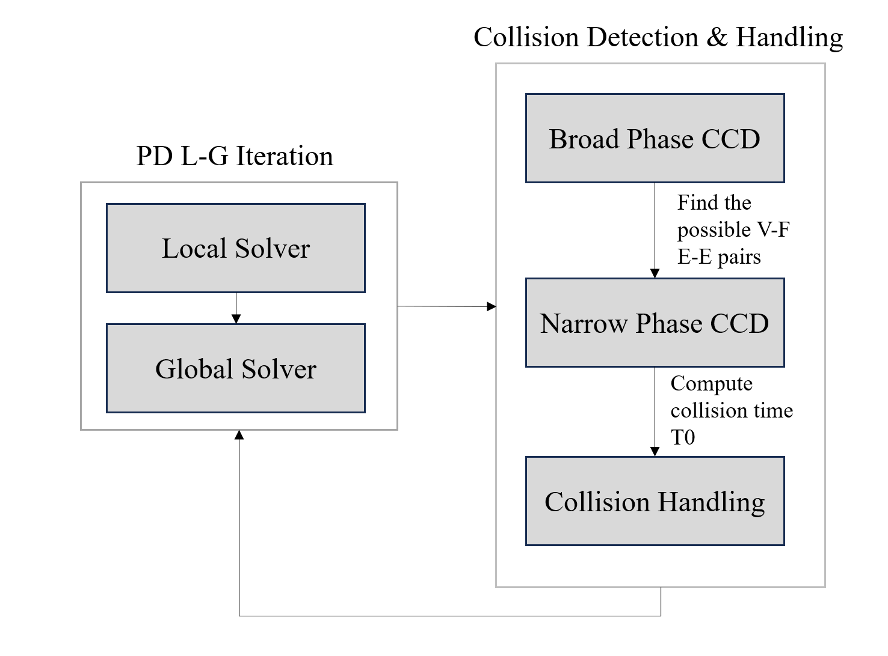
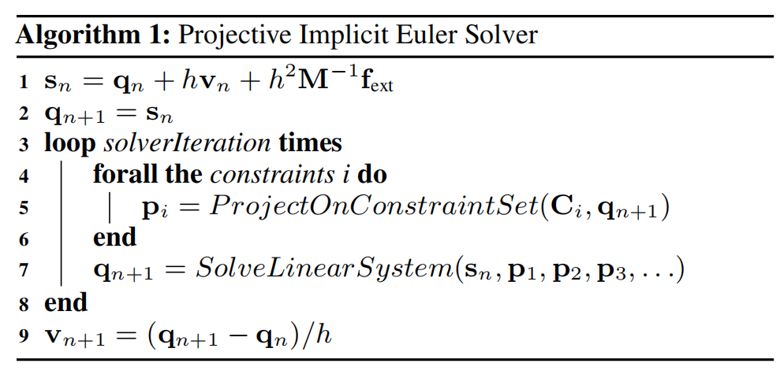
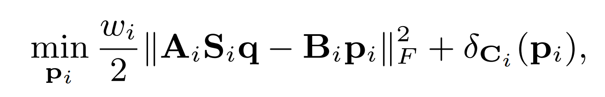
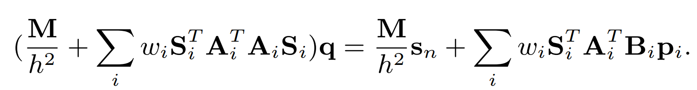
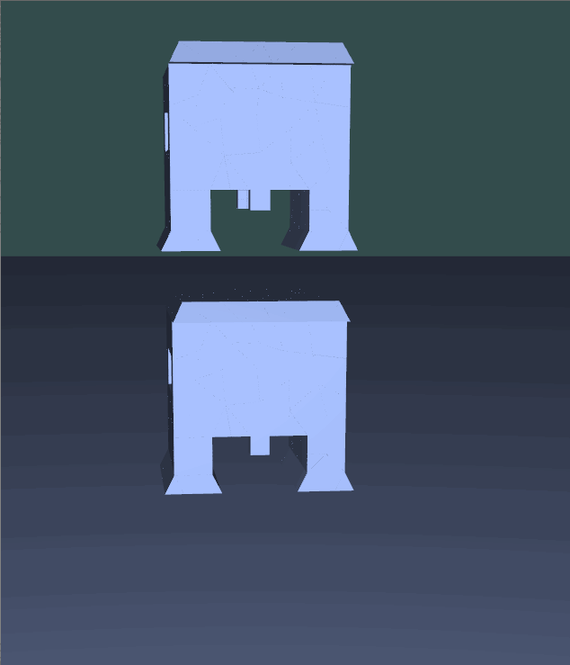
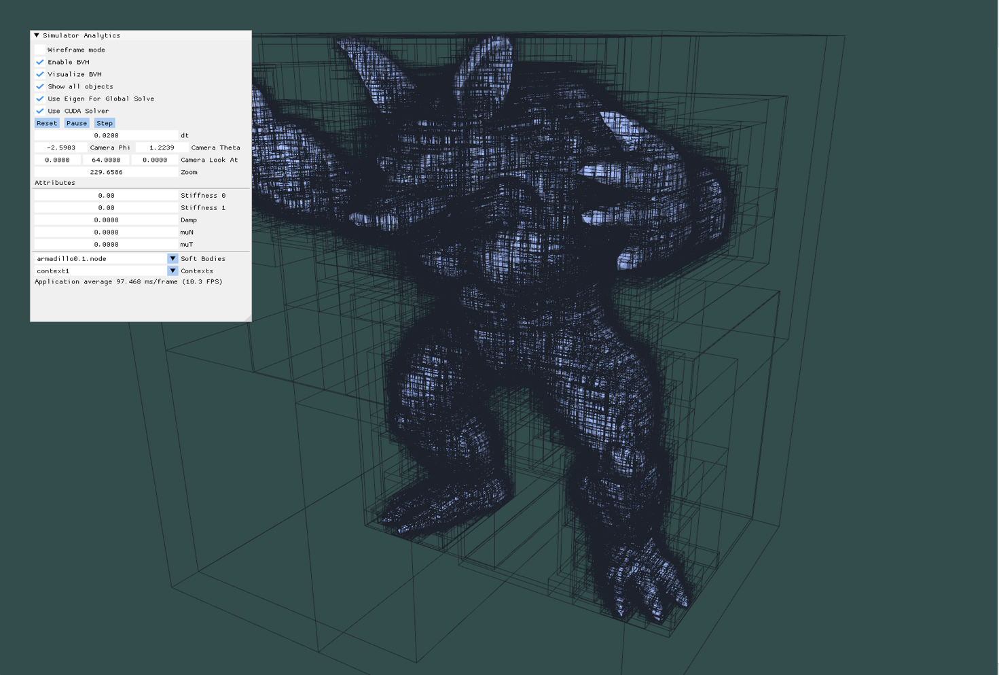
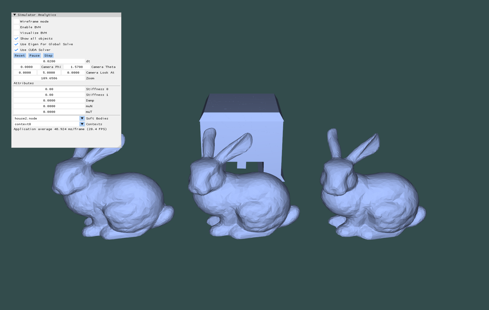

CUDA-Accelerated Soft Body Simulation
================

**University of Pennsylvania, CIS 565: GPU Programming and Architecture, Final Project**

* Gehan Zheng, Hanting Xu

## Project Overview
The goal of our project is to develop an efficient and real-time soft body simulation system with OpenGL+CUDA and achieve high-quality and interactive simulations by optimizing collision detection through GPU-based Continuous Collision Detection (CCD) techniques. The following diagram gives the overview of what our project basically does.

 * 

 As shown above, this project can be roughly divided into 2 parts. The first part is Projective Dynamics for softbody simulation and the second part part is the collision detection and handling phase.

## Projection Dynamics
 ### Theoretical Background

 Projection dynamics builds a bridge between nodal Finite Element methods and Position Based Dynamics, and it leads to a simple, yet accurate solver that supports many different types of constraints.

 The figure below demonstrates the basic algorithm of PD. It chiefly comprise of a local solver that projects each element onto local constraints by solving a small nonlinear problem per element and a global solver that combines the result of individual projections and finds the compromise between them.

 

  ### Implementation
   #### Local Solver
  The local step of the Projection Dynamics solver projects the position of each vertex onto the local constraint. It intends to minimize the elastic potential locally by optimizing the following equation:
   
  where Si is a constant selection matrix that selects the vertices involved in the ith constraint, A and B are constant matrices, pi being the auxiliary variables.

  This step can be easily parallelized on GPU, as only SVD and simple multiplications on 3x3 matrices are involved.
   #### Global Solver
  For the global step, we just use a linear solve to find the q in the following equation:
   
  To deal this function, two ways of solving this large sparse linear problem are implemented with Eigen on CPU and cuSolver on GPU. Both way solve the problem by precompute and factorize the A matrix. And by our current observation, the Eigen implementation runs faster than the cuSolver one.

## Collision Detection & Handling
 ### Theoretical Background
 In this part, the process of continuous collision detection can be divided into two parts: broad phase collision detection and narrow phase collision detection. The purpose of broad phase collision detection is to find out all the possible collision pairs and to cut down the computation in the narrow phase, which could be computationally expensive. For the narrow phase CCD, it aims to find out whether the collision actually exist in these pairs and obtain the collision time. With collisions found, we are able to resolve and remove the collisions.
 ### Implementation
 #### Broad Phase CCD
 Basically in this step, we build a BVH tree with its leaf bounding box covering the trajectory of each tetrahegon in the softbody. And we use each vertex and edge to traverse the tree and obtain the Vertex-Face and Edge-Edge pairs respectively.

 We have our BVH tree built on the GPU side, which follows the steps shown in the figure below:
  
 To get more information about building BVH on GPU, one can refers to the [blog](https://developer.nvidia.com/blog/thinking-parallel-part-iii-tree-construction-gpu/) and the [paper](https://developer.nvidia.com/blog/parallelforall/wp-content/uploads/2012/11/karras2012hpg_paper.pdf). Our implementation basically follows the same logic as the articles shown above. The only difference might be that we provide several ways of building the bounding box for the internal nodes. These methods includes naive serial merge according to tree depth, merging with atomic operation, cooperative groups. According to our observation, using cooperative groups the performance is spedup greatly.

 #### Narrow Phase CCD
 The fundamental algorithm for Narrow Phase CCD is that:  
 we fisrly check whether the four points in VF or EE are coplanar.  If is coplanar, set collision time to 1 and there is no need to do the further check.  
 Then we check whether the Vertex-Face / Edge-Edge pairs intersect inside and compute the cubic equation to obtain the exact collision time T.

 For the detialed implementation, we first do a double traversal on the BVH tree to obtain the possible VF and EE pairs respectively. And then we implemented the coplanar test and use the newton method to solve the cubic equation to obtain the collision time. Our implementation supports different precisions for computation.

 #### Collision handling
 The goal of collision handling is to remove all the collisions found. And our implementation follows the implementation below:  
 If a collision is detected on the vertex, we just roll that vertex back to its position in the last frame.  
 Apart from that we exert a repulsive force on the vertex to push it out of the collision zone, by apply a velocity against the normal of the plane intersected.

## GUI Supports

We allow users to：
* Predefine soft bodies and multiple simulation contexts in a config file
* Switch between different simulation contexts
* Pause and step through the simulation by clicking a step button
* Set rendering and simulation properties (such as visualizing BVH, hiding objects, using cuSOLVER, rendering in wireframe, etc.)

## Performance Analysis
## Conclusion
## Showcase
  

  

  
