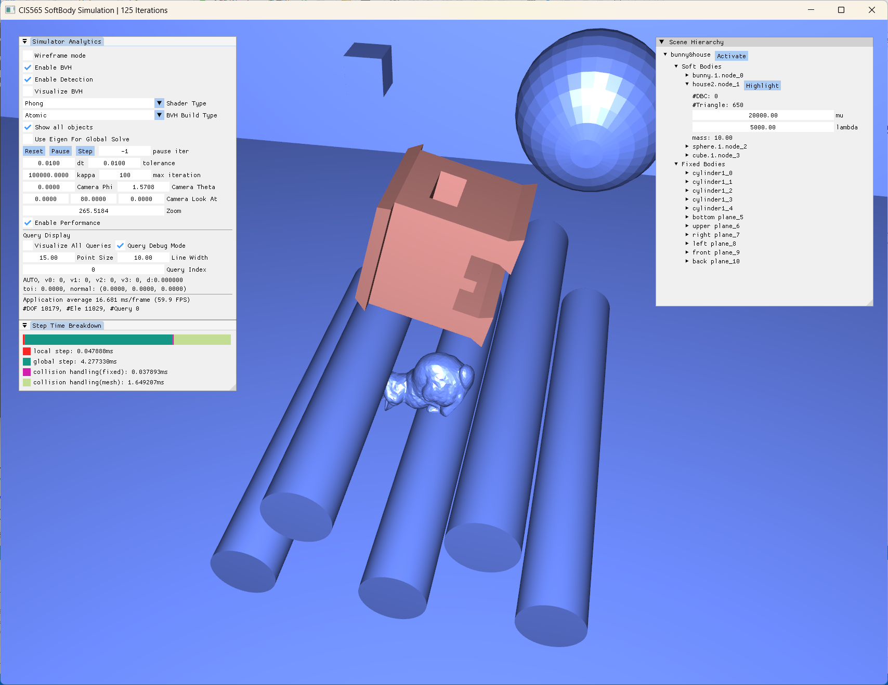

CUDA-Accelerated Soft Body Simulation
================

**University of Pennsylvania, CIS 565: GPU Programming and Architecture, Final Project**

* Gehan Zheng ([LinkedIn](https://www.linkedin.com/in/gehan-zheng-05877b24a/), [personal website](https://grahamzen.github.io/)),
Hanting Xu

## Click [here](https://github.com/GrahamZen/Soft-Body-Simulation-CUDA/tree/CIS5650-Final) for documentation (CIS5650 Final Project version)

## Requirements

- CUDA >= 12.0 (cublas, cusolver)
- CMake >= 3.18

## Description

This project is originally a final project for CIS5650 at UPenn and is still under development. The goal of this toy project is to provide a CUDA-accelerated physical simulation framework with dependencies as few as possible, in which various simulation algorithms can be implemented and tested.

## Features

* Linear solvers
  * [x] sparse cholesky prefactorization w/ approximate minimum degree ordering
  * [x] dense cholesky prefactorization
  * [x] jacobi solver (naive)
  * [x] cholesky decomposition
  * [x] preconditioned conjugate gradient

* FEM
  * [x] projective dynamics
      * [x] Direct (cusolver's cholesky)
      * [x] Chebyshev acceleration
  * [x] explicit euler
  * [x] incremental potential
    *  materials
         * [x] corotational
         * [ ] neo-hookean
    * barrier
      * [x] spheres, planes, cylinders
      * [ ] soft bodies
* Collision detection
  * [x] real-time bvh
  * [x] ccd
  * [ ] robust collision handling

## Dependencies

* [CUDA](https://developer.nvidia.com/cuda-downloads)
* [CMake](https://cmake.org/download/)

Below are included in the project:

* OpenGL
* ImGui
* spdlog
* Eigen
* glfw
* catch2

## Screenshots

https://github.com/user-attachments/assets/1c088da8-6842-4ba1-9514-9ba6ddd2cf92

