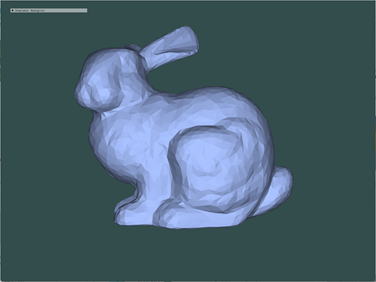
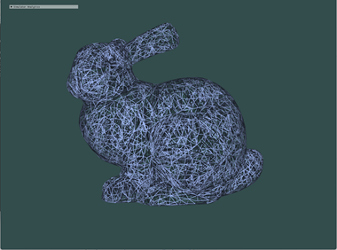
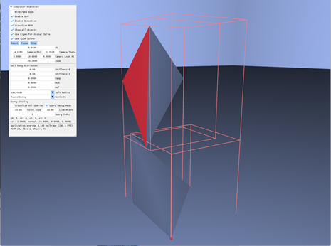
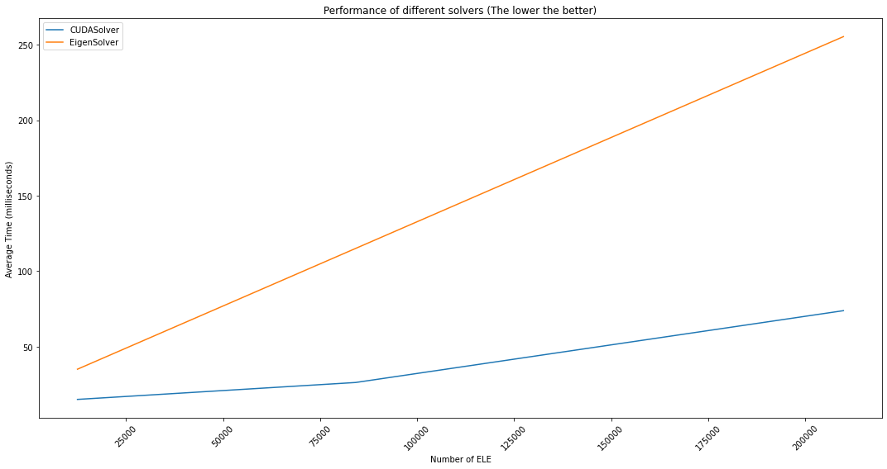
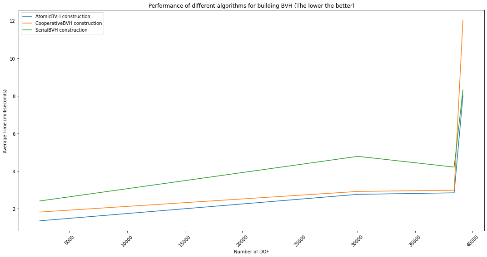
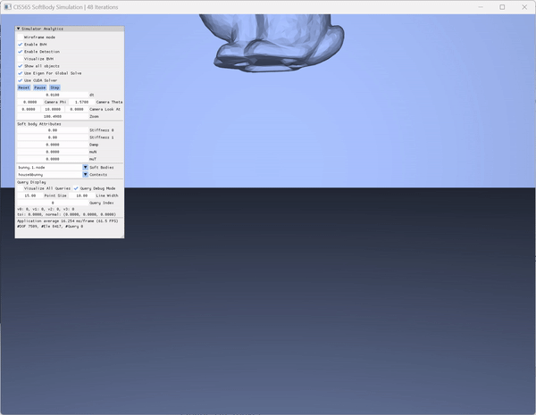
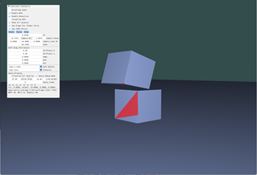
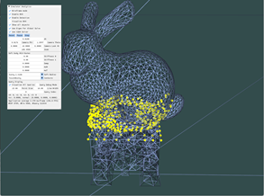
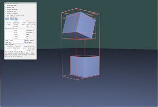
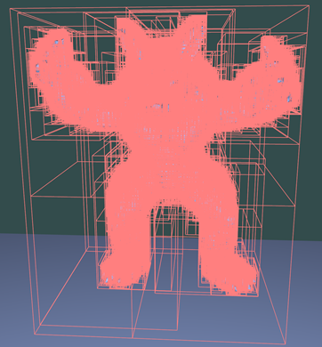

CUDA-Accelerated Soft Body Simulation
================

**University of Pennsylvania, CIS 565: GPU Programming and Architecture, Final Project**

* Gehan Zheng ([LinkedIn](https://www.linkedin.com/in/gehan-zheng-05877b24a/), [personal website](https://grahamzen.github.io/)),
Hanting Xu

* Plugin built for for: Windows 10/11 (x64)
* Tested on: Windows 11, AMD Ryzen 7 5800H @ 3.2GHz 16GB, GeForce RTX 3060 Laptop 6144MB (Personal Laptop)

## Project Overview

The goal of our project is to develop an efficient and real-time soft body simulation system with OpenGL + CUDA and achieve high-quality and interactive simulations by optimizing collision detection through GPU-based Continuous Collision Detection (CCD) techniques. The following diagram gives the overview of what our project basically does.

As shown above, this project can be roughly divided into 2 parts. The first part is Projective Dynamics for soft body simulation and the second part part is the collision detection and handling phase.

## Background

### Finite Element Method

In soft body simulation, FEM is a popular method. It is a numerical technique for finding approximate solutions to boundary value problems for partial differential equations. Usually it uses variational methods (the calculus of variations) to minimize an error function and produce a stable solution. In our case, we use the Projective Dynamics method. For soft body simulation, we are mostly dealing with tetrahedral meshes. 

| Triangle Mesh | Tetrahedra |
| ---------------------------------------------- | ---------------------------------------------- |
|  | |

Generally, the energy of a tetrahedron (similar to the energy in a spring, determined by the strain model used) is calculated using the deformation gradient, which is similar to the concept of transformation matrix. In our case, we use the Corotated material.

### Projective Dynamics

Projective Dynamics (PD) is a method that bridges the gap between nodal Finite Element methods and Position Based Dynamics. It results in a straightforward yet accurate solver capable of handling various types of constraints. The core algorithm of PD consists of two primary solvers: a local solver and a global solver.

### Collision Detection & Handling

CCD can be divided into two stages: 
* broad phase collision detection: aims to identify potential collision pairs to reduce computation in the narrow phase.
*  narrow phase collision detection: focuses on determining the actual existence of collisions in these pairs and calculating the collision time. Once collisions are detected, they can be resolved and eliminated.

## Implementation

### Simulation

The framework of our simulation is shown below. 

#### Projective Dynamics: Local Solver

The local step of the Projective Dynamics solver projects the position of each vertex onto the local constraint. It intends to minimize the elastic potential locally by optimizing the following equation:

 

where Si is a constant selection matrix that selects the vertices involved in the ith constraint, A and B are constant matrices, pi being the auxiliary variables.

This step can be easily parallelized on GPU, as only SVD and simple multiplications on 3x3 matrices are involved.

#### Projective Dynamics: Global Solver

For the global step, we just use a linear solve to find the q in the following equation:

To deal this function, two ways of solving this large sparse linear problem are implemented with `Eigen` on CPU and cuSolver on GPU. Both way solve the problem by precomputing and factorizing the A matrix. cuSolver seems to be faster than `Eigen`, but naively using `cusolverSpScsrcholFactor` and `cusolverSpScsrcholSolve` results in a much slower performance than `Eigen`! The reason is that these algorithm works for sparse matrices. Though the matrix itself is sparse, after the factorization, the matrix can be dense. The solution is to first apply **approximate minimum degree** reordering to the matrix to get a permutation vector, and then do the factorization with the permutation vector. When solving the linear system, we also need to apply the permutation vector to the right-hand side and apply the inverse permutation vector to the solution. The result is incredible! When the number of DOF is over 100000, fps is still stable at 60 for the GPU version.

## Collision Detection & Handling

### Broad Phase CCD

This part consists of two steps: building BVH tree and traversing the tree to obtain the possible collision pairs, including Vertex-Face and Edge-Edge pairs, which will be called Query in the following context.

#### Building BVH tree

We have our BVH tree built on the GPU side, which follows the steps:

1. Build AABB bounding box for each tetrahedron as the leaves for the BVH tree
2. Compute a unique morton code for each leaf node according to its position and index
3. Split tree to get the structure of the internal nodes according to the morton codes
4. Build the bounding box for each of the internal node from bottom to up

To get more information about building BVH on GPU, one can refers to the [blog](https://developer.nvidia.com/blog/thinking-parallel-part-iii-tree-construction-gpu/) and the [paper](https://developer.nvidia.com/blog/parallelforall/wp-content/uploads/2012/11/karras2012hpg_paper.pdf). Our implementation basically follows the same logic as the articles shown above. 

The only difference might be that we provide several ways of building the bounding box for the internal nodes. These methods includes naive serial merge according to tree depth, merging with atomic operation, cooperative groups. 

**Cooperative groups**

The reason we use cooperative groups, is that we want to move the iterations of the for loop to the kernel function. Since every node should be aware of its children, we need to synchronize all the threads. And cooperative groups provide us with the ability to synchronize the whole grids. However, the number of threads in a grid is limited. So, when the number of nodes is large, this method is not applicable.

**Atomic operation**

For Atomic operation, we let those threads whose children are not ready to wait until they are ready. 

#### Traversing BVH tree

There are two ways of implementing collision detection. 
1. directly solve the query after a broad phase detects a collision, obtaining relevant information which is then processed by the simulation context (or even directly handled). 
2. The broad phase detects collisions and first compiles a query array, which is then processed together in the narrow phase. 

When implemented on the CPU, the performance difference is not significant because the overall complexity is relatively similar. However, once implemented in parallel, especially on the GPU, the latter's performance far exceeds the former. This is because most of the checks conducted by threads in the broad phase are ineffective, but these threads must remain idle while other threads perform tasks with extremely high computational requirements, significantly impacting occupancy. Therefore, if implemented in CUDA, the latter option is definitely preferable.

However, the number of collision queries obtained in each collision detection is **uncertain**. Thus, decoupling the broad phase and narrow phase in CPU-based collision detection is much simpler than on the GPU, as dynamic memory allocation can be easily managed on the CPU, whereas the GPU does not natively support the allocation of dynamic arrays. Therefore, we have to manage dynamic memory allocation ourselves. Before filling an array with atomic operations in a thread, we must check whether continuing to fill the array will cause it to overflow. If so, we terminate the current BVH traverse, reallocate memory that is twice as large, and then reperform the BVH traverse.

For traversing the BVH tree, we consider that a collision may occur when the bounding boxes of two tetrahedra intersect, and in such cases, we store the corresponding 52 queries in the query array(4 vertices * 4 vertices + 6 edges * 6 edges). The following image shows the moment when the bounding boxes of two tetrahedra intersect.

Since we don't want to solve duplicate queries, we need to sort each query so that they are comparable. Then we can use the `thrust` library to sort and deduplicate the query array. Before that, queries that are invalid (e.g. a query where the vertex is the same as one of the face's vertices) should be removed. The following image shows the whole process of broad phase CCD.

### Narrow Phase CCD

For the narrow phase CCD, different types of queries are handled differently. But for solving the cubic equation, we use the same method for both VF and EE pairs. All queries are solved in parallel:

1. Check whether the four points in VF or EE are coplanar. If is coplanar, set collision time to 1 and there is no need to do the further check.
2. Check whether the Vertex-Face / Edge-Edge pairs intersect inside and solve the cubic equation using Newton's method to obtain the collision time, and then check **whether the collision time is valid**. 
3. If the collision time is valid, the collision is valid and the collision time and the normal is recorded. Otherwise, the collision is invalid and the collision time is set to 1.

#### Collision handling

The goal of collision handling is to remove all the collisions found. And our implementation follows the implementation below:  
1. If a collision is detected on the vertex, we just roll that vertex back to its position in the last frame.  
2. Apart from that we exert a repulsive force on the vertex to push it out of the collision zone, by apply a velocity against the normal of the plane intersected.

## GUI & Visualization

We allow users to define a simulation context in a config file in JSON format. The config file contains the following information:
* camera settings
* force settings
* predefined soft bodies, including transform, material, data file, etc.
* predefined fixed objects, including transform
* simulation contexts, each of which contains a list of soft bodies, a list of fixed objects and some simulation properties such as gravity, time step, etc.

The GUI is implemented using ImGui. Users can switch between different simulation contexts, and switch between different soft bodies to let them jump. Besides, users can enable/disable the collision detection and handling, and enable/disable the visualization of the BVH tree, all queries, and single query specified by the user through a slider. 

## Performance Analysis

### Projective Dynamics

The graph shows a performance comparison when only using `Eigen` and CUDA to compute the strain constraints of tetrahedra, which is the part of the paper that is highly suitable for parallelization. It is evident that there is a significant improvement in performance. If other parts of the `Eigen` version were also implemented on the CPU, the difference in performance would be even greater. 

However, as the number of tetrahedra increases, it's observable that the rate of performance improvement decreases. This is because the computational resources of the GPU are limited, and when the number of threads exceeds a certain amount, true full parallelism cannot be achieved.

### BVH construction

Regarding the construction of BVH, as mentioned earlier, we implemented the computation of the AABB of internal BVH nodes in three ways, which significantly impacts performance. As shown in the graph, the serial construction method is the slowest because it requires multiple kernel function launches. Converting the serial algorithm to a cooperative group logic is straightforward, but as previously mentioned, it has a limit on the number of threads, so this part of the BVH analysis did not use scenarios with a very high degree of freedom (DOF) for comparison. The atomic operation method for construction is the fastest, as each BVH node is managed by an individual thread and only requires a single operation within one kernel function. The granularity of synchronization is similar to the grid sync of a cooperative group but often involves fewer steps. Thus, the time cost is relatively close to the cooperative group version. 

However, it is notable that when the DOF reaches 40,000, the cooperative group version's cost increases rapidly, indicating that the expense of synchronizing the entire grid escalates quickly with the increase in the number of threads.

## Showcase

### Simulation

When the weight of the constraint is too low: OOOPS!

A simple scene with a bunny, a sphere, and a cube.

### Visualization

|Single Query| All Queries | BVH|
| ---------------------------------------------- | ---------------------------------------------- | ---------------------------------------------- |
|  | |  |

**The BVH of an Armadillo**

